# System Patterns

## Latest Update [2024-02-27]

### UI Enhancement Patterns

#### Navigation Pattern

- Fixed/sticky navigation for persistent access
- Integrated metrics toggle in navigation
- Fancy font for logo text
- Consistent spacing and visual hierarchy

#### Page Structure Pattern

- Home page: Feature showcase and value proposition
- Dedicated page for document upload and chat interface
- Feedback collection integrated into document/chat page

#### User Feedback Pattern

- Simple form for general feedback, issues, and suggestions
- No rating system for responses
- No discussions section
- Focus on collecting actionable feedback

### Architecture Updates

- Headless API-first design implemented
- Client library integration patterns defined
- Multi-framework support patterns established
- Documentation patterns formalized

### Pattern Changes [2024-02-23 15:45 UTC]

1. Implemented Repository Pattern for document storage
2. Added Factory Pattern for client configuration
3. Enhanced Strategy Pattern for model selection
4. Updated Observer Pattern for progress tracking

## Vector Search Pattern [2025-04-30 3:53:00 AM EDT]

- **Purpose:** Improve context relevance for Q&A by using semantic similarity instead of keyword matching.
- **Components:**
  - **Embedding Model:** OpenAI `text-embedding-3-small` used via `src/lib/llm-service.ts` (`generateEmbedding` function) to convert text chunks and questions into 1536-dimension vectors.
  - **Vector Database:** Pinecone (managed service) used to store and query text chunk vectors. Client initialized in `src/lib/pinecone-client.ts`.
- **Workflow:**
  - **Indexing (on Upload - `/api/upload/route.ts`):**
    1. Extract text content from the uploaded document.
    2. Split text into overlapping chunks (`splitIntoChunks`).
    3. Generate an embedding vector for each chunk (`generateEmbedding`).
    4. Upsert vectors into Pinecone index, including metadata (document ID, user ID, chunk index, original text). Vectors are batched for efficiency.
  - **Querying (on Ask - `/api/ask/route.ts`):**
    1. Generate an embedding vector for the user's question (`generateEmbedding`).
    2. Query the Pinecone index using the question vector (`pineconeIndex.query`).
    3. Apply filters to the query based on `userId` and optionally `documentIds`.
    4. Retrieve the `topK` most similar vectors, including their metadata.
    5. Extract the original text from the metadata of the retrieved vectors.
    6. Use this extracted text as the context for the LLM prompt (`buildPromptWithContextLimit`).
- **Benefits:** Provides more semantically relevant context to the LLM, leading to potentially more accurate and helpful answers compared to simple keyword matching.
- **Considerations:** Introduces dependencies on external services (OpenAI, Pinecone) and associated costs/latency. Requires careful management of the vector index.

---

## Architecture Overview

### API-First Design

- Headless architecture
- RESTful API endpoints
- Stateless operations
- Clear separation of concerns

### Component Structure

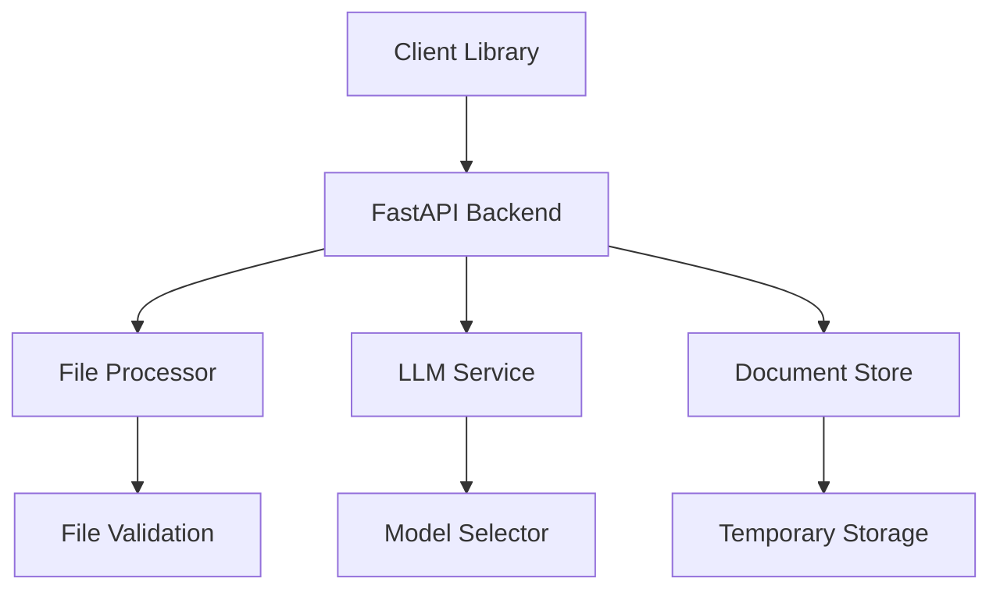

## Design Patterns

### Repository Pattern

- Document storage abstraction
- Model provider abstraction
- File system operations

### Factory Pattern

- LLM model instantiation
- Document processor creation
- Client configuration

### Strategy Pattern

- Model selection
- File processing
- Error handling

### Observer Pattern

- Upload progress tracking
- Question processing status
- Error reporting

## Component Relationships

### Client Library → API

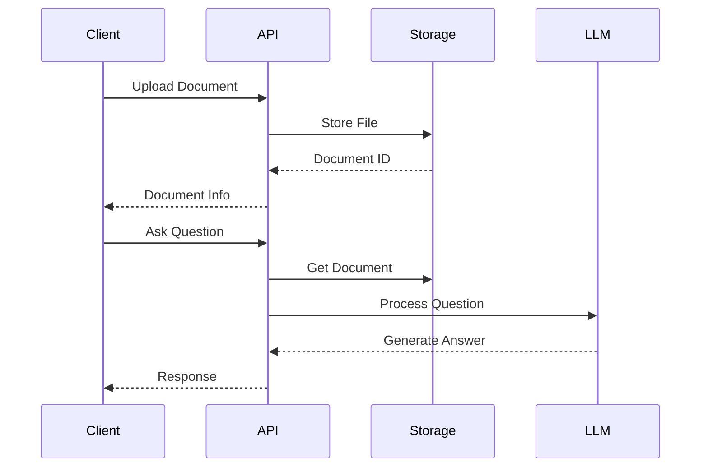

### Error Handling Flow

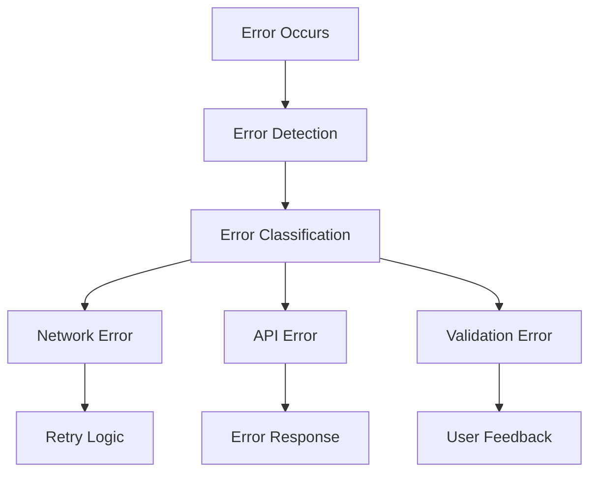

## Data Flow

### Document Processing

1. File upload received
2. Validation performed
3. Document stored
4. ID returned

### Question Processing

1. Question received
2. Document retrieved
3. Context extracted
4. LLM query constructed
5. Response generated
6. Answer returned

## Integration Patterns

### Direct Integration

```typescript
const client = new DocumentQAClient(config);
await client.method();
```

### Event-Based Integration

```typescript
client.on("upload", handleUpload);
client.on("question", handleQuestion);
client.on("error", handleError);
```

## Security Patterns

### Authentication Flow

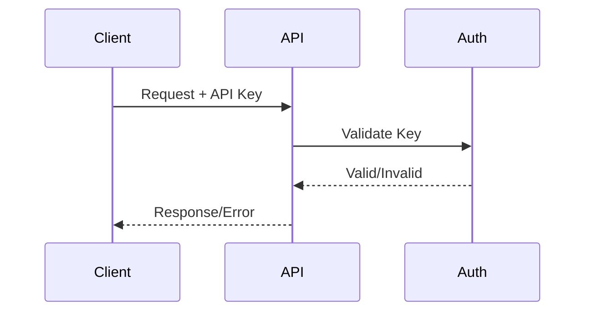

### File Validation Flow

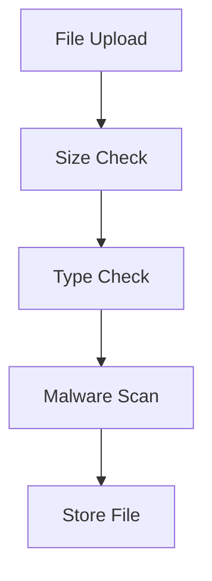

## Error Handling Patterns

### Client-Side

- Retry logic
- Error classification
- User feedback
- Graceful degradation

### Server-Side

- Input validation
- Error logging
- Structured responses
- Recovery mechanisms

### LLM Provider Errors

1. Provider Availability

   - Circuit breaker pattern implemented
   - Automatic fallback to next available provider
   - Success case: Meta Llama 3.1 8B recovery
     - Previous 503 errors handled gracefully
     - Service now stable and responding
     - Error handling system validated

2. Response Timeouts

   - Configurable timeout per provider
   - Automatic retry with exponential backoff
   - Maximum retry attempts enforced

3. Rate Limiting
   - Per-provider rate limits respected
   - Queue system for high-load scenarios
   - Graceful degradation implemented

## State Management

### Backend State

1. **Document State**

   - Upload status
   - Processing status
   - Cache status

2. **Session State**

   - Chat history
   - Context window
   - User preferences

3. **System State**
   - Service health
   - Resource usage
   - Error conditions

### Frontend State

1. **UI State**

   - Loading states
   - Error states
   - Success states

2. **Form State**

   - Input validation
   - File selection
   - Submission status

3. **Chat State**

   - Message history
   - Typing indicators
   - Voice recording

4. **Model State**
   - Provider selection
   - Model selection
   - Model availability

## Performance Patterns

### Caching Strategy

1. **Document Cache**

   - Content caching
   - Metadata caching
   - Cache invalidation

2. **Response Cache**

   - LLM responses
   - Frequent queries
   - Context windows

3. **Static Cache**
   - UI components
   - Static assets
   - API responses

### Optimization Patterns

1. **Lazy Loading**

   - Component loading
   - Image loading
   - Data fetching

2. **Connection Pooling**

   - Database connections
   - API connections
   - Resource management

3. **Batch Processing**
   - Document processing
   - Cache updates
   - Data synchronization

## Security Patterns

### Authentication

1. **API Security**

   - API key management
   - Rate limiting
   - Request validation

2. **File Security**

   - Upload validation
   - Storage security
   - Access control

3. **Data Security**
   - Data encryption
   - Secure storage
   - Privacy controls

### Authorization

1. **Access Control**

   - Resource limits
   - Feature access
   - User permissions

2. **Rate Limiting**
   - API rate limits
   - Upload limits
   - Request throttling

## Testing Patterns

### Unit Testing

- Component isolation
- Mock dependencies
- Edge cases
- Error scenarios

### Integration Testing

- API endpoints
- File processing
- LLM integration
- Error handling

## Monitoring Patterns

### Health Checks

- API availability
- LLM service status
- Storage capacity
- Rate limits

### Performance Metrics

- Response times
- Error rates
- Resource usage
- Cache hits/misses

## Architecture Overview

## :start_line:377

## :start_line:377

### Backend Architecture [2025-04-25 01:37]

```mermaid
graph TD
    Client[Client] --> API[FastAPI Server]
    API --> DocService[Document Service]
    API --> LLMService[LLM Service]
    API --> VoiceService[Voice Service]

    DocService --> LocalFileStorage[Local File Storage]
    DocService --> DocumentCache[Document Cache]
    DocService --> ContentExtraction[Content Extraction (PDF, DOCX, TXT)]
    DocService --> LLMFallback[LLM Fallback Extraction]

    LLMService --> LLMProviders[LLM Providers (Groq, Together, Deepseek, Gemini, OpenAI)]
    LLMService --> TextChunking[Text Chunking]
    LLMService --> PromptCreation[Prompt Creation]
    LLMService --> PerformanceLogging[Performance Logging (S3)]

    VoiceService --> WhisperAPI[Whisper API]
    VoiceService --> AudioCache[Audio Cache]
```

### Frontend Architecture

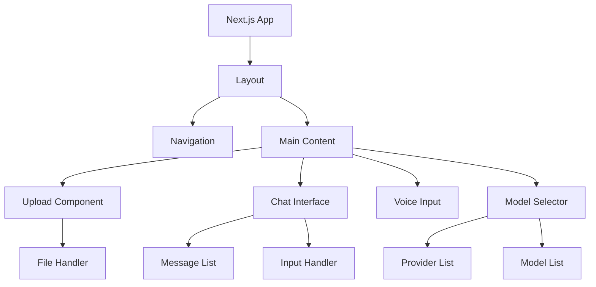

## Design Patterns

## :start_line:423

### Backend Patterns [2025-04-25 01:44]

1. **Service Layer Pattern**

   - **Implementation:** The backend logic is organized into distinct service classes (`LLMService`, `DocumentStorage`, `DocumentService`) that encapsulate specific functionalities.
   - **Purpose:** Promotes separation of concerns, making the codebase more modular, maintainable, and testable.

2. **Strategy Pattern**

   - **Implementation:** Used in `LLMService` for selecting different LLM providers and in `DocumentService` for choosing the appropriate content extraction method based on file type, with a fallback to LLM-based extraction.
   - **Purpose:** Allows for flexible and interchangeable algorithms or behaviors (LLM providers, extraction methods) to be used based on the context.

3. **Repository Pattern**

   - Document storage abstraction
   - Cache management
   - File system operations

4. **Service Layer**

   - Business logic isolation
   - External API integration
   - Error handling

5. **Factory Pattern**

   - Service instantiation
   - Configuration management
   - Resource allocation

6. **Strategy Pattern**
   - Document processing
   - LLM provider selection
   - Cache strategies

### Frontend Patterns

1. **Component Composition**

   - Reusable UI elements
   - Layout management
   - State containment

2. **Container/Presenter**

   - Logic separation
   - UI/UX consistency
   - State management

3. **Observer Pattern**
   - Real-time updates
   - State synchronization
   - Event handling

## Error Handling

### Error Types

1. **Validation Errors**

   - File type validation
   - Size limit validation
   - Format validation

2. **Service Errors**

   - LLM API errors
   - File storage errors
   - Processing errors

3. **Network Errors**
   - Connection timeouts
   - API rate limits
   - Service unavailable

### Recovery Strategies

1. **Circuit Breaker**

   - Service health monitoring
   - Fallback mechanisms
   - Recovery procedures

2. **Retry Logic**

   - Exponential backoff
   - Maximum retry limits
   - Failure thresholds

3. **Graceful Degradation**
   - Fallback content
   - Offline capabilities
   - Error messages

## State Management

### Backend State

1. **Document State**

   - Upload status
   - Processing status
   - Cache status

2. **Session State**

   - Chat history
   - Context window
   - User preferences

3. **System State**
   - Service health
   - Resource usage
   - Error conditions

### Frontend State

1. **UI State**

   - Loading states
   - Error states
   - Success states

2. **Form State**

   - Input validation
   - File selection
   - Submission status

3. **Chat State**

   - Message history
   - Typing indicators
   - Voice recording

4. **Model State**
   - Provider selection
   - Model selection
   - Model availability

## Performance Patterns

### Caching Strategy

1. **Document Cache**

   - Content caching
   - Metadata caching
   - Cache invalidation

2. **Response Cache**

   - LLM responses
   - Frequent queries
   - Context windows

3. **Static Cache**
   - UI components
   - Static assets
   - API responses

### Optimization Patterns

1. **Lazy Loading**

   - Component loading
   - Image loading
   - Data fetching

2. **Connection Pooling**

   - Database connections
   - API connections
   - Resource management

3. **Batch Processing**
   - Document processing
   - Cache updates
   - Data synchronization

## Security Patterns

### Authentication

1. **API Security**

   - API key management
   - Rate limiting
   - Request validation

2. **File Security**

   - Upload validation
   - Storage security
   - Access control

3. **Data Security**
   - Data encryption
   - Secure storage
   - Privacy controls

### Authorization

1. **Access Control**

   - Resource limits
   - Feature access
   - User permissions

2. **Rate Limiting**
   - API rate limits
   - Upload limits
   - Request throttling

## Testing Patterns

### Test Types

1. **Unit Tests**

   - Service tests
   - Component tests
   - Utility tests

2. **Integration Tests**

   - API tests
   - Service integration
   - UI integration

3. **E2E Tests**
   - User flows
   - Feature tests
   - Performance tests

### Test Strategy

1. **Test Coverage**

   - Code coverage
   - Feature coverage
   - Error scenarios

2. **Test Automation**
   - CI/CD integration
   - Automated testing
   - Performance testing

## Theme System Pattern

### Theme Propagation Pattern

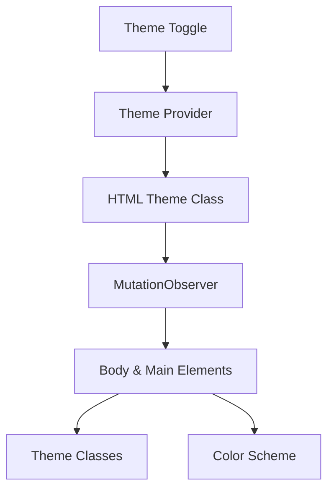

1. **Component Structure**

   - ThemeProvider: Manages theme state
   - MutationObserver: Watches for theme changes
   - Theme Propagator: Updates child elements

2. **Theme Management**

   - HTML element as source of truth
   - Class-based theme switching
   - Style attribute synchronization
   - Explicit theme propagation

3. **Implementation Strategy**
   - Use MutationObserver for changes
   - Explicit class management
   - Style attribute updates
   - Hydration-safe approach

## Document Processing

### Chunking Strategy

- Document text is split into chunks of 500 characters
- Chunks are created by respecting sentence boundaries
- Maximum of 8 chunks can be selected for context
- Maximum context length is 4000 characters

### Chunk Selection Algorithm

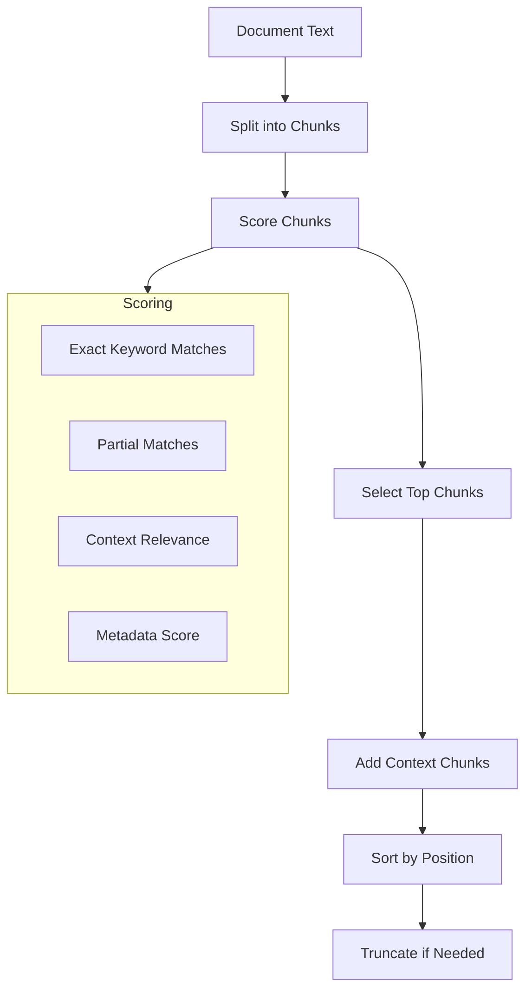

### Scoring Components

1. Exact Keyword Matches (40%)
   - Direct matches between question keywords and chunk text
2. Partial Matches (20%)
   - Substring matches between keywords and chunk words
3. Context Relevance (20%)
   - Relevance of surrounding chunks
4. Metadata Score (20%)
   - Additional score for metadata-related terms

### Caching Strategy

- Document content cache (5 minutes TTL)
- Document path cache (5 minutes TTL)
- Question-answer cache (1 hour TTL)
- LRU cache for MIME type detection

## Error Handling

### Document Processing

- Fallback encoding (UTF-8 -> latin-1)
- PDF text extraction with logging
- File size and type validation
- Hash verification for uploads

### LLM Integration

- Token limit management
- API error handling
- Response validation
- Cache management

## Environment Management

### Configuration

- Environment variables loaded from .env
- Explicit validation of required variables
- Secure API key handling
- Clear error messages for missing configs

### File Management

- Secure file uploads
- Temporary file cleanup
- Path validation
- MIME type verification

## Code Organization

### Service Layer

1. **LLM Service**

   ```python
   class LLMService:
       def __init__(self):
           self.max_chunk_size = 500
           self.max_chunks = 2
           self.cache_ttl = 3600

       def _split_into_chunks(self, text: str) -> List[str]:
           # Split by paragraphs
           # Maintain chunk size limits
           # Preserve context

       def _get_relevant_chunks(self, chunks: List[str], question: str) -> List[str]:
           # Remove common words
           # Score by keywords
           # Select top chunks

       async def get_answer(self, document_id: str, question: str) -> str:
           # Get document content
           # Process chunks
           # Get LLM response
           # Cache results
   ```

2. **Document Service**

   ```python
   class DocumentService:
       def __init__(self):
           self.upload_dir = Path(settings.UPLOAD_DIR)
           self.content_cache = {}
           self.path_cache = {}

       async def save_document(self, file: UploadFile) -> str:
           # Validate file
           # Save content
           # Generate ID
           # Cache content

       async def get_document_content(self, document_id: str) -> bytes:
           # Check cache
           # Read file
           # Handle encoding
           # Cache result
   ```

### Error Handling

1. **Exception Hierarchy**

   ```python
   class DocumentError(Exception):
       """Base class for document-related errors."""

   class InvalidFileTypeError(DocumentError):
       """Invalid file type uploaded."""

   class FileSizeLimitError(DocumentError):
       """File size exceeds limit."""

   class DocumentNotFoundError(DocumentError):
       """Document not found in storage."""
   ```

2. **Error Recovery**
   ```python
   try:
       content_str = content.decode('utf-8')
   except UnicodeDecodeError:
       content_str = content.decode('latin-1')
   ```

### Configuration Management

1. **Settings Class**

   ```python
   class Settings(BaseSettings):
       UPLOAD_DIR: str
       GROQ_API_KEY: str
       MODEL_NAME: str

       model_config = SettingsConfigDict(
           env_file=".env",
           env_file_encoding="utf-8"
       )
   ```

2. **Environment Loading**
   ```python
   load_dotenv(env_file)
   settings = Settings()
   ```

## Multi-Model Architecture

The system implements a flexible multi-model architecture that supports various LLM providers:

1. Model Selection Pattern

   - Frontend provides a model selector component
   - Users can switch between providers and models dynamically
   - Model selection is persisted per session
   - Default model is used if no selection is made
   - Dynamic model list updates
   - Fallback to defaults on invalid selections

2. Provider Integration Pattern

   - Each provider has its own client initialization
   - API keys are managed through environment variables
   - Common interface for all providers through the LLMService
   - Graceful fallback if a provider's API key is missing
   - Provider-specific error handling
   - Response format normalization

3. Model Configuration Pattern

   ```python
   AVAILABLE_MODELS = {
       "groq": {
           "llama-3.2-3b-preview": "Meta Llama 3.2-3B",
       },
       "together": {
           "meta-llama/Meta-Llama-3.1-8B-Instruct-Turbo": "Meta Llama 3.1-8B",
       },
       "deepseek": {
           "deepseek-chat": "Deepseek V3",
       },
       "gemini": {
           "gemini-1.5-flash-8b": "Gemini 1.5 Flash-8B",
       },
       "openai": {
           "gpt-4o-mini": "GPT-4o mini",
       }
   }
   ```

4. Model Switching Strategy

   ```typescript
   // Frontend model selection handling
   const handleProviderChange = (value: string) => {
     setSelectedProvider(value);
     const provider = providers.find((p) => p.id === value);
     if (provider) {
       setAvailableModels(provider.models);
       const firstModel = Object.keys(provider.models)[0];
       setSelectedModel(firstModel);
     }
   };
   ```

5. Model Response Processing
   ```python
   async def get_completion(self, prompt: str) -> str:
       client = self.clients[self.current_provider]
       try:
           if self.current_provider == "groq":
               response = await client.chat.completions.create(...)
           elif self.current_provider == "together":
               response = await client.chat.completions.create(...)
           elif self.current_provider == "deepseek":
               response = await client.chat.completions.create(...)
           elif self.current_provider == "gemini":
               response = await client.generate_content(...)
           elif self.current_provider == "openai":
               response = await client.chat.completions.create(...)
           return response.choices[0].message.content
   ```

## Architecture Patterns

### Service Layer Pattern

1. LLM Service:

   - Provider initialization and management
   - Model selection and fallback
   - Response caching
   - Error handling and retry logic

2. Document Service:

   - File processing and storage
   - Content extraction
   - Caching mechanism
   - Performance tracking

3. Metrics Service:
   - Performance data collection
   - Real-time metrics aggregation
   - Data persistence
   - Visualization preparation

### API Design Patterns

1. RESTful Endpoints:

   - Resource-based routing
   - Standard HTTP methods
   - Consistent error responses
   - Proper status codes

2. Middleware:
   - Request validation
   - Error handling
   - Logging
   - Performance monitoring

### Frontend Patterns

1. Component Architecture:

   - Atomic design principles
   - Reusable components
   - Container/Presenter pattern
   - Error boundaries

2. State Management:
   - React Query for server state
   - Local state for UI
   - Context for global state
   - Custom hooks for logic

## Design Patterns

### Backend

1. Factory Pattern:

   - LLM provider initialization
   - Service creation
   - Configuration management

2. Strategy Pattern:

   - LLM provider selection
   - Document processing
   - Caching strategies

3. Observer Pattern:
   - Metrics collection
   - Performance monitoring
   - Real-time updates

### Frontend

1. Compound Components:

   - Dashboard widgets
   - Form components
   - Error displays

2. Render Props:

   - Data visualization
   - Loading states
   - Error handling

3. Custom Hooks:
   - API integration
   - State management
   - UI logic

## Error Handling

1. Backend:

   - Provider-specific error handling
   - Graceful degradation
   - Detailed logging
   - User-friendly messages

2. Frontend:
   - Error boundaries
   - Toast notifications
   - Retry mechanisms
   - Loading states

## Performance Patterns

1. Caching:

   - Response caching
   - Document caching
   - Metrics caching
   - Cache invalidation

2. Optimization:
   - Lazy loading
   - Code splitting
   - Resource optimization
   - Memory management

## Current Focus

- Implementing metrics dashboard
- Enhancing error handling
- Optimizing performance
- Improving user experience

## Critical Working Configurations

### [2024-02-26] Working CI Configuration (PRESERVE - DO NOT MODIFY)

Reference Commit: `5308538` - Last Known Working CI Configuration

#### 1. GitHub Actions Workflow Pattern

```yaml
# CRITICAL: This exact configuration passes CI
name: CI
on:
  push:
    branches: [main]
  pull_request:
    branches: [main]

jobs:
  test:
    runs-on: ubuntu-latest
    steps:
      - uses: actions/checkout@v3
      - name: Set up Python
        uses: actions/setup-python@v4
        with:
          python-version: "3.11"
      - name: Install system dependencies
        run: |
          sudo apt-get update
          sudo apt-get install -y python3-dev libmagic1 tesseract-ocr poppler-utils
      - name: Install dependencies
        run: |
          python -m pip install --upgrade pip
          pip install -r requirements.txt
          pip install pytest pytest-asyncio flake8
          pip install -e .
      - name: Set PYTHONPATH
        run: echo "PYTHONPATH=${{ github.workspace }}" >> $GITHUB_ENV
      - name: Run tests
        env:
          TESTING: "true"
          GROQ_API_KEY: "test_groq_key"
          TOGETHER_API_KEY: "test_together_key"
          DEEPSEEK_API_KEY: "test_deepseek_key"
          GEMINI_API_KEY: "test_gemini_key"
          OPENAI_API_KEY: "test_openai_key"
          AWS_ACCESS_KEY_ID: "test_aws_key_id"
          AWS_SECRET_ACCESS_KEY: "test_aws_secret_key"
          AWS_DEFAULT_REGION: "us-east-1"
        run: |
          python -m pytest tests/ -v
```

#### 2. Critical Project Configuration

```toml
# pyproject.toml critical sections
[tool.pytest.ini_options]
asyncio_default_fixture_loop_scope = "function"
testpaths = ["tests"]
python_files = ["test_*.py"]
python_classes = ["Test*"]
python_functions = ["test_*"]
filterwarnings = [
    "ignore::DeprecationWarning",
    "ignore::UserWarning",
]
```

#### 3. Test Pattern Requirements

1. Global asyncio mark required
2. Proper fixture scoping
3. Mock service configurations
4. Resource cleanup

#### DO NOT MODIFY:

- Python version (3.11)
- Test command structure
- System dependencies
- Environment variable names
- Fixture patterns
- Test file structure

#### ALWAYS MAINTAIN:

- Exact dependency versions
- Mock configurations
- Resource cleanup
- Environment variables
- Test patterns

## Next.js Configuration Patterns

1. Configuration Best Practices:

   - Use .mjs extension for Next.js config when using TypeScript
   - Remove deprecated or invalid configuration options
   - Keep configuration minimal and focused
   - Validate configuration changes with clean builds

2. Troubleshooting Patterns:

   - Clean .next directory when encountering build issues
   - Check for duplicate directories that might conflict (e.g., app/ at root)
   - Verify environment variables are correctly set
   - Use curl to test API endpoints and server responses

3. Project Structure Patterns:
   - Maintain clear separation between src/app and root directories
   - Avoid duplicate configuration files (e.g., next.config.js and next.config.mjs)
   - Follow Next.js App Router conventions for page and layout components
   - Keep middleware focused on security headers and routing rules

### Blog Content Patterns [2024-02-27]

#### Article Structure Pattern

- Clear, descriptive titles
- Publication date metadata
- Comprehensive comparisons
- Technical accuracy focus
- Performance metrics inclusion

#### Content Organization

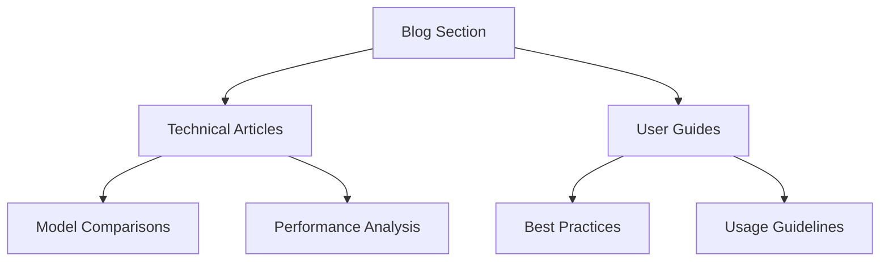

#### Content Flow Pattern

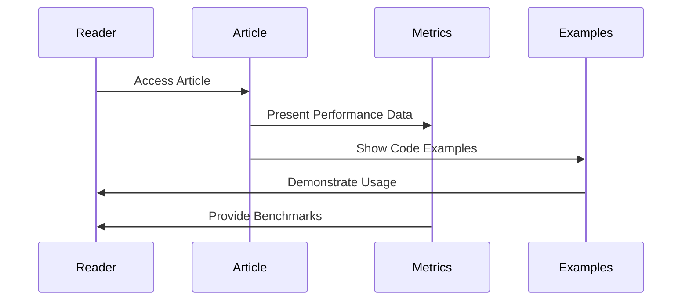

#### Article Components Pattern

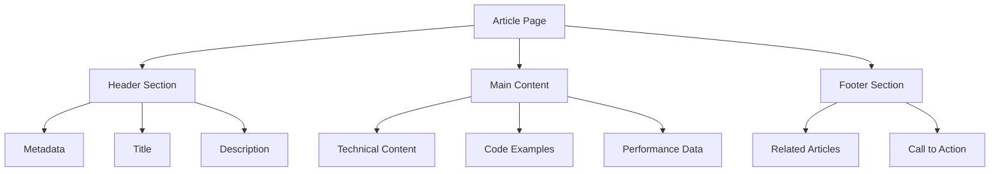

### S3 Metrics Architecture

#### Metrics Storage Pattern

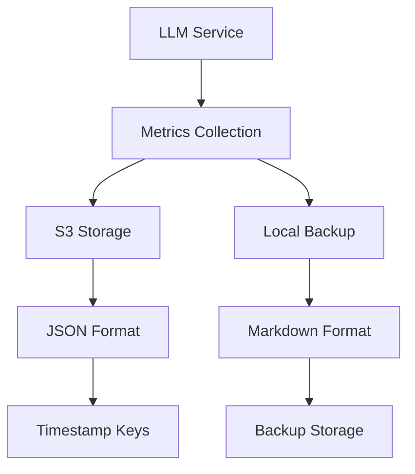

#### Metrics Flow Pattern

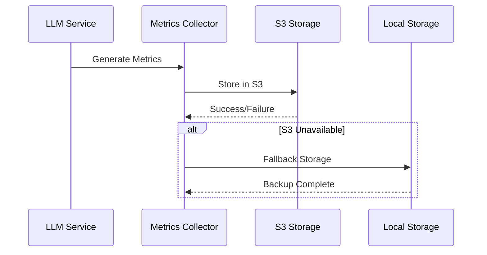

#### Key Components

1. Metrics Collection

   - Timing metrics
   - Document metrics
   - LLM performance data
   - System health data

2. S3 Integration

   - Asynchronous uploads
   - JSON formatting
   - Timestamp-based keys
   - Error handling

3. Local Backup
   - Markdown format
   - Automatic fallback
   - Data consistency
   - Migration support

# System Patterns [2024-02-28 06:45]

## Documentation System

### Page Structure Pattern [2024-02-28 06:45]

```tsx
const DocumentationPage = () => {
  return (
    <div className="container mx-auto px-4 py-8 max-w-4xl">
      <h1 className="text-3xl font-bold mb-8">Page Title</h1>
      <section className="bg-white p-6 rounded-lg shadow-md">
        <h2 className="text-2xl font-semibold mb-4 flex items-center">
          <IconComponent />
          Section Title
        </h2>
        {/* Content */}
      </section>
    </div>
  );
};
```

### Icon System Pattern [2024-02-28 06:45]

```tsx
// Header Icons
<svg
  className="w-6 h-6 mr-2 text-blue-600"
  fill="none"
  stroke="currentColor"
  viewBox="0 0 24 24"
>
  <path
    strokeLinecap="round"
    strokeLinejoin="round"
    strokeWidth="2"
    d="..."
  />
</svg>

// Subheader Icons
<svg
  className="w-5 h-5 mr-2 text-blue-600"
  fill="none"
  stroke="currentColor"
  viewBox="0 0 24 24"
>
  <path
    strokeLinecap="round"
    strokeLinejoin="round"
    strokeWidth="2"
    d="..."
  />
</svg>
```

### Link Pattern [2024-02-28 06:45]

```tsx
<Link
  href="/path"
  className="text-blue-600 hover:text-blue-800 flex items-center group"
>
  <IconComponent className="group-hover:text-blue-800" />
  Link Text
</Link>
```

### Card Pattern [2024-02-28 06:45]

```tsx
<div className="bg-white p-6 rounded-lg shadow-md">
  <h3 className="text-xl font-medium mb-3 flex items-center">
    <IconComponent />
    Card Title
  </h3>
  <p className="text-gray-600 mb-4">Card content</p>
  <Link className="text-blue-600 hover:text-blue-800">Call to action →</Link>
</div>
```

### Grid Layout Pattern [2024-02-28 06:45]

```tsx
<div className="grid md:grid-cols-2 gap-4">
  <Card />
  <Card />
</div>
```

## Quiz Creation Mode Pattern [2025-05-02 18:02:22]

- **Purpose:** Enable users to create and take quizzes generated from their documents to test understanding and knowledge retention.
- **Components:**
  - **Quiz Generator:** Creates quizzes from document content using LLM integration via `QuizGenerator.tsx` and `/api/quiz/generate`.
  - **Quiz Display:** Renders quizzes with different question types via `QuizDisplay.tsx` and `/api/quiz/[quizId]`.
  - **Quiz Results:** Shows performance with detailed feedback via `QuizResults.tsx` and `/api/quiz/[quizId]/results`.
- **Database Schema:**
  - **Quiz Model:** Stores quiz metadata (title, description, difficulty, etc.)
  - **QuizQuestion Model:** Stores individual questions with multiple types (multiple choice, true/false, short answer)
  - **QuizResponse Model:** Records user answers to questions
  - **QuizResult Model:** Stores overall performance data with sharing capabilities
- **Workflow:**
  - **Quiz Creation:**
    1. User selects a document and quiz parameters (size, difficulty)
    2. Backend extracts document content
    3. LLM generates a title and appropriate questions based on content
    4. Questions are stored in the database with correct answers
    5. User is directed to take the quiz immediately or view it later
  - **Quiz Taking:**
    1. User navigates to a specific quiz
    2. Frontend loads questions without revealing answers
    3. User submits answers for each question
    4. Backend grades answers (exact matching for multiple choice, LLM evaluation for short answers)
    5. Results are calculated and stored
  - **Quiz Results:**
    1. User views detailed performance breakdown
    2. Results can be shared via unique links with optional privacy controls
    3. Explanations for correct answers are provided
- **Benefits:** Enhances learning and knowledge retention through interactive testing, provides objective measurement of document understanding.
- **Integration Points:** Connected to document storage system, user authentication, and LLM services.
